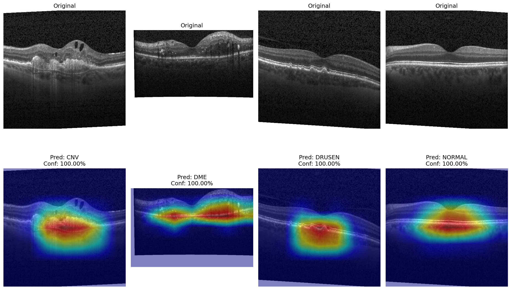
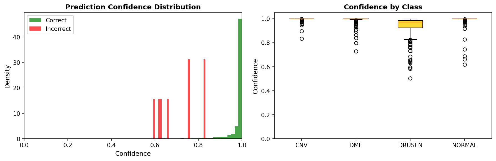

# Retinal OCT Disease Classification

A deep learning system for classifying retinal diseases from Optical Coherence Tomography (OCT) images. The model distinguishes between four conditions: Choroidal Neovascularization (CNV), Diabetic Macular Edema (DME), Drusen, and healthy retinas. Built with PyTorch and trained on the Kermany2018 dataset, it achieves 97.8% validation accuracy and 99.6% test accuracy using transfer learning with EfficientNet-B3.

## Results

| Dataset | Accuracy | Samples |
|---------|----------|---------|
| Training | 99.5% | 66,787 |
| Validation | 97.8% | 16,697 |
| Test | 99.6% | 968 |

Per-class performance on the validation set:

| Class | Precision | Recall | F1-Score |
|-------|-----------|--------|----------|
| CNV | 98.6% | 98.6% | 98.6% |
| DME | 96.8% | 96.8% | 96.8% |
| DRUSEN | 92.9% | 92.9% | 92.9% |
| NORMAL | 98.8% | 98.8% | 98.8% |

## Visualizations

### Grad-CAM Interpretability
The model's attention regions visualized using Gradient-weighted Class Activation Mapping. The model correctly focuses on pathologically relevant structures: subretinal fluid (CNV), intraretinal cysts (DME), drusen deposits (DRUSEN), and normal foveal architecture (NORMAL).



### Confidence Distribution
The model shows high confidence on correct predictions and lower confidence on errors, indicating well-calibrated uncertainty:



## Architecture

The classifier uses EfficientNet-B3 as a backbone, pretrained on ImageNet and fine-tuned on the OCT dataset. The architecture includes a custom classification head with dropout regularization. Training uses mixed-precision (FP16) for efficiency, AdamW optimizer with cosine annealing learning rate schedule, and standard augmentations including rotation, brightness adjustment, and Gaussian noise.

## Installation

```bash
git clone https://github.com/tomalmog/retinal-oct-classifier.git
cd retinal-oct-classifier
pip install -r requirements.txt
```

## Dataset

This project uses the Kermany2018 OCT dataset available on Kaggle. Download it using the Kaggle API:

```bash
python download_data.py
```

The dataset contains approximately 84,000 retinal OCT images organized into four classes.

## Usage

Training:
```bash
python train.py --config config.yaml
```

Evaluation with visualizations:
```bash
python evaluate.py --checkpoint outputs/checkpoints/last.ckpt --output-dir outputs/evaluation
```

## Configuration

Model and training parameters are defined in `config.yaml`. Key settings include the backbone architecture (supports EfficientNet variants, ConvNeXt, and Vision Transformers via the timm library), batch size, learning rate, and augmentation options.

## Project Structure

```
retinal-oct-classifier/
├── config.yaml
├── train.py
├── evaluate.py
├── download_data.py
├── requirements.txt
├── src/
│   ├── data/
│   ├── models/
│   ├── training/
│   └── visualization/
└── outputs/
    ├── checkpoints/
    └── evaluation/
```

## Pretrained Model

The trained model is available on Hugging Face: [tomalmog/oct-retinal-classifier](https://huggingface.co/tomalmog/oct-retinal-classifier)

## References

Kermany, D.S., et al. "Identifying Medical Diagnoses and Treatable Diseases by Image-Based Deep Learning." Cell, 2018.

## License

MIT
